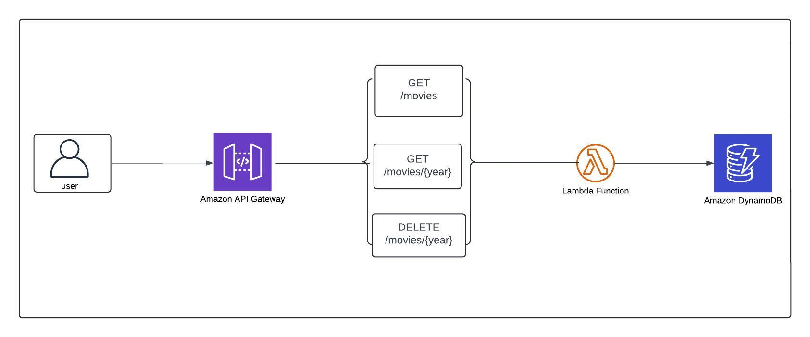

# Serverless Movie API

## Overview


This project is a serverless API built using AWS Lambda, API Gateway, and DynamoDB. The API allows users to fetch, filter, and delete movies based on specific criteria such as year.

## Features

- **Fetch all movies**: Retrieve all movies from the DynamoDB table.
- **Fetch movies by year**: Retrieve movies released in a specific year.
- **Delete movies by year**: Delete all movies released in a specific year.

## Technologies Used

- **Amazon API Gateway**: To expose the Lambda functions as HTTP endpoints.
- **AWS Lambda**: To handle the logic of the API.
- **DynamoDB**: To store and manage the movie data.
- **boto3**: AWS SDK for Python to interact with DynamoDB.

## Prerequisites

- AWS Account.
- Python 3.12 installed on your local environment.
- Postman for testing the API.

## Installation

### 1. Clone the repository:
```bash
git clone https://github.com/your-username/movie-api.git
cd movie-api
```
### 2. Set Up DynamoDB:
Ensure that you have a DynamoDB table named `movies-data` with a partition key `id`and an sort key `year` of type string. The `database.py` file contains the `update_table()` function which is responsible for adding default movie entries to your DynamoDB table automatically when the Lambda function is triggered.

### 3. Set Up AWS Lambda:
Go to the AWS Console and navigate to AWS Lambda.
Click Create Function.
Choose Author from scratch.
Name your function and select Python 3.12 as the runtime.
Upload the Code:

Zip your project directory including the database.py and main lambda_handler.py files.
Under Code source, click Upload from and select the zip file containing your code.
Set Up Execution Role:

Ensure that your Lambda function has an IAM role with permissions to interact with DynamoDB.
Attach a policy that grants read/write access to DynamoDB.

Deploy the API:

Configure API Gateway to expose the Lambda function. Create routes (/getmovies, /getmovies/{year}, /delmovies/{year}) that trigger the corresponding Lambda function for each HTTP method.
Test the Lambda Function:

You can test your Lambda function directly in the AWS Console by passing mock event data or by invoking the API via Postman after the API Gateway setup.
## API Endpoints
Method	Endpoint	Description

- **GET	/movies**	Fetches all movies in the DynamoDB table.
- **GET	/movies/{year}**	Fetches all movies for a specific year.
- **DELETE	/movies/{year}**	Deletes all movies for a specific year.
Example Requests

1. Fetch All Movies (GET /movies)

GET /movies
```
{
  "message": "Movies fetched successfully",
  "data": [
    {
      "id": "1",
      "title": "Only murders in the building",
      "year": "2024"
    },
    ...
  ]
}
```
2. Fetch Movies by Year (GET /movies/{year})

GET /movies/2024
```
Response (if movies found):
{
  "message": "Movies from year 2010 fetched successfully",
  "data": [
    {
      "id": "1",
      "title": "Only murders in the building",
      "year": "2024
    }
  ]
}
```
Response (if no movies found):
```
{
  "message": "No movies found for year 2024"
}
```
3. Delete Movies by Year (DELETE /movies/{year})

DELETE /delmovies/2024
Response (if movies deleted):
```
{
  "message": "All movies from year 2024 deleted successfully"
}
```
Response (if no movies found):
```
{
  "message": "No movies found for year 2010"
}
```

## Error Handling
400 Bad Request: Returned when invalid inputs or parameters (e.g., invalid year) are passed.
404 Not Found: Returned when no movies are found for the given year in the database.
500 Internal Server Error: Returned when there is a server-side error during Lambda execution.
You can test the API using Postman or cURL.

## Logs and Monitoring
You can monitor your Lambda functions and view logs using AWS CloudWatch.

Navigate to the CloudWatch Logs section of the AWS Console.
Filter logs for your Lambda function to see invocations, errors, and print statements for debugging.

## Contributing
Contributions are welcome! Please follow these steps to contribute:

Fork this repository.
Create a new feature branch (git checkout -b feature-branch).
Commit your changes (git commit -am 'Add new feature').
Push to the branch (git push origin feature-branch).
Create a pull request to merge your changes.
